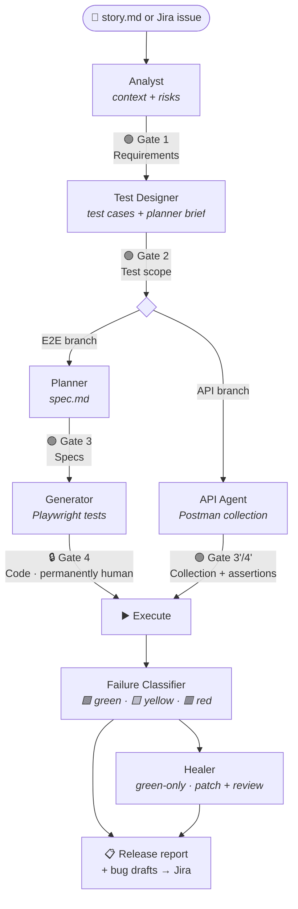
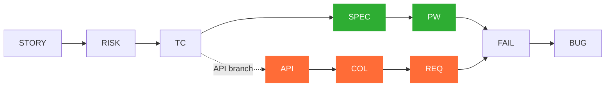

<div align="center">

# 改善 &nbsp;Qaizen

**Agile-aligned QA where artificial intelligence and human judgment work in balance.**

[](https://github.com/MiltonKlun/Qaizen/actions/workflows/qa-pipeline.yml)


</div>

> _Kaizen_ (改善, "change for better"): continuous improvement through small,
> concrete steps, where people and system are inseparable — neither improves
> without the other.

You give it a story (from Jira or a local `story.md`); it produces validated
test cases, Playwright E2E specs and tests, Postman/Newman API checks, a
classified failure analysis, a release report, and bug drafts ready to file.
**Four human gates** sit between the steps. The last one — code review — is
permanently human, and no flag, script, or CI job can pass it.

> [!IMPORTANT]
> It is **not** an autonomous agent. It makes a QA engineer faster, not absent.

---

## 🤔 Why it exists

You could just ask an AI to "write Playwright tests for this story." That's
faster to a first result. This pipeline is slower, but it buys four things raw
prompting doesn't:

| | Guarantee | What it means |
| --- | --- | --- |
| 🧾 | **Auditability** | Every artifact is schema-validated; every gate decision is recorded with telemetry. |
| 🔗 | **Traceability** | An unbroken chain from story → risk → test case → test → failure → bug. |
| 🎭 | **No fictional tests** | Tests are written against the _running app_ (via Playwright MCP), never invented from story text. |
| 🛡️ | **Guardrails** | The auto-healer can fix a broken selector but can never weaken, skip, or delete a test. |

When that trade isn't worth it (a throwaway script, a one-line tweak), the
honest answer is "prompt the AI directly" — see [docs/when-to-use.md](docs/when-to-use.md).

---

## 🚪 Quickstart — three doors

You don't need the whole pipeline to get value. Pick a door:

```bash
npm install

# 1. SEE IT — a 10-minute, fully offline, deterministic walkthrough of all
#    four gates and the FAIL → bug-draft → release-report chain.
npm run demo:pipeline

# 2. USE ONE PIECE — adopt a single capability (no full flow). See the
#    standalone one-pagers under docs/standalone-*.md.

# 3. RUN THE PIPELINE — drive a real story through the four gates.
npm run pipeline -- --story <path-to-story.md | JIRA-KEY>
```

[docs/when-to-use.md](docs/when-to-use.md) helps you decide which door fits a given story.

---

## ⚙️ How it works

A story flows through five stages, gated by four human checkpoints. AI agents do
the heavy lifting; humans approve at each gate.



> 🟢 = recorded human gate · 🔒 = **permanently** human (never automatable)

### The four gates

| Gate | After | The human checks |
| --- | --- | --- |
| **1 — Requirements** | Analyst | ACs accurate, risks meaningful, no invented rules |
| **2 — Test scope** | Test Designer | Coverage, priorities, automation decisions justified |
| **3 — Specs** | Planner | Specs match scope, negative cases present |
| 🔒 **4 — Code** _(permanent)_ | Generator | Stable locators, real assertions, no skipped/weakened tests |

### Traceability chain

Every artifact locates itself here; a link that can't be made is recorded as
`traceability_unresolved`, never faked:



### The tech stack

| Layer | Pieces |
| --- | --- |
| 🧱 **Discipline** | JSON Schemas + AJV · traceability IDs · folder ownership · four human gates · Architecture Stability Rule |
| 🤖 **Custom agents** | analyst · test-designer · api-agent · failure-classifier · reporter · spec-reviewer |
| 🎭 **Playwright Native Agents** | planner · generator · healer |
| 🔌 **Official MCPs** _(reused, never rewritten)_ | Atlassian (Jira) · Playwright · Postman · TestLink |
| 🛠️ **Runtime** | Node 20+ · TypeScript (strict) · Playwright 1.56+ · Newman · ESLint · Prettier · GitHub Actions CI |

---

## 📟 Commands

| Command | What it does |
| --- | --- |
| `npm run pipeline -- --story <ref>` | Drive a story through the four gates (the runner) |
| `npm run demo:pipeline` | Offline 10-minute demo of the full flow |
| `npm test` | Run the generated Playwright E2E suite |
| `npm run test:api` | Run the Postman collections via Newman |
| `npm run classify` | Rule-based failure classification (🟩 / 🟨 / 🟥) |
| `npm run heal` | Guardrailed healer — produces reviewable patches, never commits |
| `npm run metrics` | Aggregate pipeline metrics from run history |
| `npm run validate:all` | Validate every committed artifact against its schema |
| `npm run scan:gate4 -- <spec>` | Static pre-Gate-4 scan (assists review) |

Standalone capabilities (adopt one piece without the whole pipeline):
[failure classifier](docs/standalone-failure-classifier.md) ·
[healer](docs/standalone-healer.md) ·
[test designer](docs/standalone-test-designer.md).

---

## 🗂️ Repository layout

| Path | Contents |
| --- | --- |
| `agents/` | Custom agent prompts (analyst, test-designer, reporter, …) |
| `skills/` | Lifecycle skills adapted from `dogkeeper886/ai-qa-workflow` |
| `schemas/` | JSON Schema contracts for every artifact (AJV-validated) |
| `scripts/` | The runner, validators, classifier, healer, metrics, demo |
| `docs/` | Architecture, gates, traceability, integration & fit guides |
| `examples/` | Example stories, expected outputs, the offline demo fixtures |
| `tests/` · `api-tests/` | Generated Playwright tests · Postman collections |
| `runs/` | Archived run history (one snapshot per story run) |
| `.github/workflows/` | CI: quality gate (blocking) + informational jobs |

---

## 📐 Key design choices

- **Reuse before building** — official MCPs and Playwright Native Agents over
  custom code; this cut bespoke code by roughly half.
- **Schemas are contracts** — a schema change must move with its agent prompts,
  docs, and examples in one PR (the _Architecture Stability Rule_).
- **Healer guardrails** — 🟩 Green (auto-fix as a reviewable patch) / 🟨 Yellow
  (suggest only) / 🟥 Red (bug draft only, never touched). Always: never change
  an expected value, delete a test, or add `.skip`.
- **Tiered ceremony** — a `lite` track for routine work, with a principled floor
  that refuses `lite` for money/security/permissions/data stories.
- **Out of scope by design** — no autonomous gate approval, no n8n, no web
  dashboard, no DB/queue. See [docs/deferred.md](docs/deferred.md) for what's
  deferred (with triggers) vs. permanently rejected.

---

## 📚 Documentation

- **[STRATEGY.md](STRATEGY.md)** — one-page "what this is and the question it answers."
- **[docs/when-to-use.md](docs/when-to-use.md)** — honest fit / don't-fit guide.
- **[docs/pipeline-runner.md](docs/pipeline-runner.md)** — how to drive the runner.
- **[docs/review-gates.md](docs/review-gates.md)** — the four gates in detail.
- **[docs/pipeline-architecture.md](docs/pipeline-architecture.md)** — the full architecture.
- **[docs/traceability.md](docs/traceability.md)** · **[docs/healer-guardrails.md](docs/healer-guardrails.md)** · **[docs/automation-decision-model.md](docs/automation-decision-model.md)**
- **[CLAUDE.md](CLAUDE.md)** — operating instructions for an AI agent working in this repo.

> [!NOTE]
> **Status:** core build complete; in continuous-improvement mode. The
> pipeline-vs-raw-prompting benchmark ([docs/evidence.md](docs/evidence.md)) is
> wired and awaiting its run series, so its verdict is honestly "not yet
> measured."

---

## 📄 License

See `LICENSE` if present; otherwise all rights reserved by the author.
